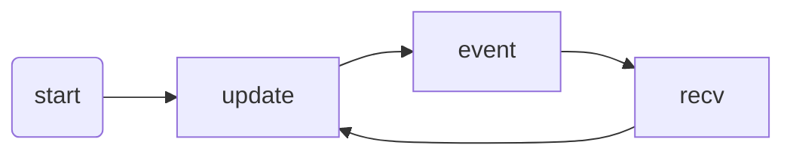

# refina

An extremely **refined** web framework.

Using ImGUI, with full TypeScript support.

No DSL or JSX, just plain TypeScript, with a little bit comptime transformation.

Works best with [tailwindcss](https://tailwindcss.com/).

## Example

```typescript
import { d, app } from "refina";
const name = d("");
let times = 0; // needn't be warped in d()
app(_ => {
  _.t`Enter your name:`;
  if (_.textInput(name)) {
    // returns true if the input is focused
    _.t`You're inputting`;
  }
  // or _.textInput(name) && _.t`You're inputting`;
  if (_.button("Click me!", name.length === 0)) {
    // returns true if the button is clicked
    times++;
    console.log(_.$ev); // TypeScript shows _.$ev is MouseEvent
  }
  if (times > 0) {
    // use if to control the rendering
    _.h1(`Hello, ${name} for the ${times}th time!`);
  }
});
```

## refina 简介

### 有许多成熟的前端框架，还需要一个新的吗？

在现在的多数网页应用里，一个页面长啥样、干啥事，其实三言两语就可以描述出来，但是用传统的前端框架实现它，却动辄数百行代码。对诸如图书检索、设备报修等数据管理型的应用，尤为如此。是时候改变这种现象了。

固然传统前端框架，比如 Vue 搭配 Vuetify，理论上可以做出细节完善、外观精美的应用。但事实上即使是某些“大厂”，也都出于开发效率的考虑，几乎从未做出过这样的网页。能够利用上传统前端框架的这些功能者少之又少，其高度可定制性成了累赘。

我们需要一款在**首先保证开发效率极高**的基础上尽可能优雅和强大的前端框架。

#### 主流前端框架的不足，在本框架中可以被改进的地方

**共性问题**

1. 没有为元素或组件的常用属性提供快捷传入的支持。即，所有参数/属性都是按名称传入的，不能按位置传入。这导致了代码冗长

**Svelte**

1. 编译过程复杂，导致用户难以想象生成的代码
2. 多个私有语法去实现复杂的模板渲染，导致同一套操作（例如 if 和 filter）在 JS 和模板中有两套语法，增加了复杂度和学习成本

**Vue**

1. script 部分没有语法糖，导致代码略显冗长
2. 响应式系统的实现比较复杂，容易产生 bug

**React**

1. 代码太长，开发效率低下
2. 有的时候简单的逻辑需要复杂的实现，原因是 JSX 过于灵活，编译期可以获知的信息太少

**Blazor**

1. .NET 运行时的加载问题
2. 对于传统的 JS 开发者不友好，难以利用丰富的 JS 库
3. 同样，没有为 HTML 元素的常用属性提供快捷传入的支持

#### 关于 Dear IMGUI 项目

IMGUI（Immediate Mode GUI）在 UI 状态管理上，是传统的 RMGUI 的反义词。一种简单的理解就是“组件内部没有状态，组件的外观完全由当次调用的参数决定”。

属于 IMGUI 的 C++著名项目 Dear IMGUI 已经在桌面应用领域颇有名气了。凭借 IMGUI 的特性，它可以非常快速地用很短的代码开发轻量级的应用。

但是在 Web 端并不能照搬 Dear IMGUI 的代码，有这几个原因：

1. 语言不同，直接照抄 C++代码无法利用 JS 的高度动态特性。
2. Web 端的渲染结果不是图形绘制，而是 DOM，而 DOM 自身只能是有状态的。
3. Web 端可以也实际上必须利用 CSS。
4. Dear IMGUI 开发出的应用多作为开发工具，而 Web 端应用多面向普通用户。
5. Web 应用经常要和后端产生数据交互，而桌面应用不需要或很少需要。

这就意味着本框架绝不是 Dear IMGUI 的移植或重写。为了适应 Web 端的种种特性，本框架在 UI 状态管理上与 Dear IMGUI 有诸多不同。准确地说，本框架不能算作严格意义上的 IMGUI，而是借鉴了 IMGUI 的一些思想。

#### 为什么 IMGUI 开发效率高？

1. **无状态**。作为框架用户，不需要给数据做响应式，也不需要指定回调函数。
2. **只有最重要的代码**。HTML 中，input 元素都应该带上 type 这个属性，却极少用到 list 这个属性。而前者仍然需要手动写`type=" "`这几个字。而 IMGUI 中则直接将其分为 TextInput 和 Checkbox 等。button 元素 99%要处理 click 事件，但是 onclick 几个字并不比 onready 要短。IMGUI 则不同：button 的布尔类型的返回值即它是否被点击。

#### 本框架兼容 TypeScript 语法

同时，为了降低学习成本，并尽可能复用社区的已有工具，我们不像 C++/CX 那样引入新的语法，而是像 C++/WinRT 那样适应现有语法，只在普通 TypeScript 的基础上引入一些新的语义。即，本框架必须满足：现有的 TypeScript Language Server 能够直接工作。

> 注：虽然 refina 代码需要经过编译才能成为无运行时错误的 TypeScript 代码，但实际上目前版本的编译器只需做 3 个简单的正则表达式替换即可。

### 框架预期效果

1. 提供 router 和对标 Vuetify or AntDesign 的组件库。
2. 有传统 Web 开发基础者，可在**一天内**上手，做出现实可用的应用。
3. 数据管理类应用，代码量减少**至**传统前端框架的**50%**。

## refina 的设计

> **注意**：本框架的设计尚未定型，以下内容很多已经不再适用。

- App
  - mount
  - DOM Tree
- View
  - embed
- Component
  - DOM Component
  - ckey / ikey
  -
- Context

## Main：主函数

App、View、Component 必须有一个主函数来描述其外观和行为。

作为应用开发者，你的主要任务就是编写这些主函数。

## Context：上下文

主函数总是被传入一个上下文。

主函数通过操作上下文来渲染组件、接收事件。

## App：应用 / View：视图 / Component：组件

App 就相当于应用的根，从它出发去调用 View 和 Component。App 管理整个应用的 DOM 树。

View 把应用分割成几个部分。比如 Login、Dashboard 等等。

Component 的目的是复用代码。比如 Button，可以在 Login 和 Dashboard 中都用到。

### AppState

App 的主函数被调用时，应用处于以下两种状态之一。

#### 1. `recv`：接收状态

接收状态每次接收一个事件。

此时不应改变 DOM。

#### 2. `update`：更新状态

各个组件会根据当前的数据更新其对应的 DOM 元素属性。

容器组件还会对比其子组件的变化，增删对应的 DOM 子元素。

此时不应该改变任何应用数据，即连续 n 次以`update`状态调用主函数应与一次调用效果完全相同。

### 执行流程



若由 n 个消息待处理，则对于这 n 个消息依次以`recv`状态调用主函数，然后以`update`状态调用主函数。

假如在某次调用`recv`时，主函数内部产生了新的事件，则该事件会被排在消息队尾。在该消息也处理完后才会以`update`状态调用主函数。

假如在已经计划更新的情况下，再次请求更新，则也只会以`update`状态调用主函数一次。

## 组件

本框架提供了一系列基础组件，它们基本上是常用 HTML 元素的对应。同时用户也可以方便地实现自己的组件。

一个组件通常分为两部分代码：

### 1. 组件类

作为组件的实例，组件类组件对应的 HTML 元素等数据。

每个组件类都必须实现获取其 HTML 根元素的接口，以供父元素将其添加为子元素。

对组件的引用即是将一个变量赋值为该组件类的实例。

组件类的构造函数是固定的，即组件唯一 id 和组件所在的视图。需要传入的属性将在合适的时机由框架直接赋值，因此不能将需要传入的属性设置为私有。

从这一层面看，组件可分为：

- 容器组件
- 元素组件

容器组件和元素组件，本质上没有区别，只是容器组件作为基类提供一些处理子组件的 helpers。

### 容器组件：以 div 为例

- 参数：被包裹的内容的视图函数
- 返回值：总是`false`

#### 为什么传入视图函数？

据了解，还有这几个方法可以实现容器组件：

1. `if(_.div()){ ... }` 这种形式，要么需要较复杂的编译期处理，要么在运行时对每一嵌套层级逐一进行处理（即，若有 5 层嵌套，则更新视图时主函数得运行 5 次，效率低下且很不直观），所以没有采用。
2. `if(_.div()){ ... } _.end();`（即 Dear IMGUI 的写法），`}`的存在使得`_.end()`显得多余，而且一旦忘记写`_.end()`就会错位，所以没有采用。
3. `_.div(); ...; _.end();`这种写法没有缩进不够美观，而且如果忘记写`_.end()`也会导致错位，所以没有采用。
4. `{ using d = _.div();  ... }`这种形式，产生了无意义的代码`d = `，强迫开发者给返回的用不着的变量取名，而且缩进上也不够美观，所以没有采用。
5. `_.div(()⇒{ ... })`这种形式虽然在缩进上不够美观，但是语法常用，且留元素的可定制程度较高，所以采用这种方式。这种方式的额外优点是，往往可以把`{`和`}`省去。

### 2. 组件方法

组件方法会被视图的主函数以及别的组件的组件方法调用。被调用时既可能处于视图更新状态也有可能处于消息接收状态。

从这一层面看，组件可分为

- 回调式组件
- 绑定式组件

### 回调式组件：以 Button 为例

- 参数：按钮文字
- 返回值：**视图处于接收消息状态**且 click 事件是被触发时为`true`，并断言`context.event`的类型为`MouseEvent`。这一点 TypeScript 的类型守卫可以自动推断出，无需手动转换类型

#### dbclick 等事件怎么办？

Button 的返回值仅仅是 click 事件是否被触发，无法响应 dbclick 事件。但是对于本框架面向的项目类型，如果出现需要用户双击按钮的地方，应该不是一个很好的设计。

### 绑定式组件：以 TextInput 为例

- 参数：文字标签、绑定的数据
- 返回值：**无论视图处于接收消息状态还是更新视图状态**，都返回输入组件是否处于焦点。不断言`context.event`的类型

#### 关于绑定的数据

JavaScript 中，原始类型总是传值，而对象类型总是传引用。对于一个双向绑定组件，我们要让组件值的更改反映到绑定的值上，因此需要将所有原始类型的数据包装成对象，以传入引用。

需要注意的是，与 Vue 的 ref 不同，本框架对于原始类型的包装仅仅是简单地将这个值作为一个对象的 value 属性，不需要 getter/setter/Proxy。

特性：

- 用一个 Symbol 索引的属性标记这个对象，以允许用通用的方式读写一个不明确是否经过包装的值。
- 实现了`Symbol.toPrimitive`，且将包装后的类型类型设置为`const T & { value: T; ... }`，使得原始值即使被包裹也可以直接传入模板字符串等需要原始值的地方。

### 组件开发

就像提供的基础元素那样，一个组件就是一个函数。首先当然要写好这个函数。这个函数通过`this.context`，而不是像视图主函数那样通过第一个参数，来访问当前 context。

为了将组件加入全局 context，一方面通过原型注入值，另一方面通过 module declaration 和 interface merging 提供类型支持。

## 组件 ID

一个组件必须要有一个全局唯一的 ID。该 ID 是将视图主函数内的某次组件函数调用对应到组件类实例的唯一方式。

为了避免每次调用组件函数都手写 ID，通过编译每个组件函数的调用均会自动加上一个全局唯一的组件 ID 参数。

#### 组件函数的**一个**调用和**一次**调用

- 一个调用：源代码中出现的字面意义的调用
- 一次调用：每一轮渲染时实际的某次调用

显然，一个调用最终可能产生 0 次或数次调用。

本框架要求每**一次**调用时可以取到某一个独立的组件 ID，而编译时自动为每**一个**调用生成一个唯一 ID，如果该个调用被多次运行，则需要通过 push 和 pop `idPrefix`数组使得每**一次**调用均可以取到不同的 ID，且恰为上次视图主函数运行时该对应组件的 ID。

**一个**调用产生**数次**调用的情况有以下两种：

1. 循环

   正如 Vue 的`v-for`一样，必须手动指定每轮循环的 key。因为框架没有办法获知当循环次数改变时如何对应新旧元素。

   本框架不建议在 JS 循环中调用组件函数，并提供了几种常用的循环方式，以确保每轮循环的 key 被设置。

2. 组件内调用了其他组件

   组合多个组件作为新组件是常见的行为。但是编译期只会为新组建中对旧组件的某一个调用生成 ID，而新组件可能被调用多次。这时新组件中的旧组件就会使用重复的 ID 产生错误。

   因此在实现新组件时，需要在其组件函数开头 push 自己的 id 到`idPrefix`数组，并在结尾 pop 之。

## 样式

前端开发中 JS 与 HTML 逐渐合二为一，比如 JSX 和 Vue SFC，当然还有本框架，都将 HTML 元素和 JS 紧密融合。但是 CSS 和 JS 之间的互操作仍然较为原始。所以现在的前端，事实上分为 JS 和 CSS 两部分：前者描述逻辑，后者描述如何展示。

与其他很多框架不同，本框架主要只支持 tailwindcss，并专门为它提供了一些设计上的便利。在 IDE 上也会为组件的样式编写提供便利。
